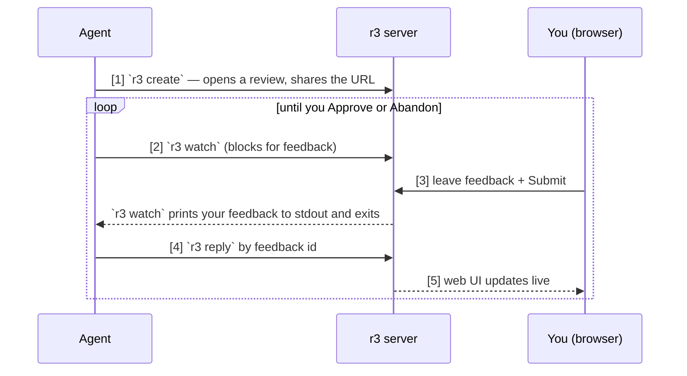

<p align="center">
  
</p>

<h1 align="center">r3: Review. Revise. Resolve.</h1>

<p align="center">
  <a href="https://www.npmjs.com/package/@hyperlogue/r3"></a>
  <a href="LICENSE"></a>
  
</p>

r3 is a review tool for the diffs and docs produced by your coding agents, running
locally with a web interface. You leave feedback pinned to the exact line or
quote it's about, and track each comment to resolution.

r3 fills a gap the chat box can't. Say your agent writes a long planning doc and
you want to fix a handful of things. In a chat you copy-paste each passage to
quote it, type your feedback, then lose track across turns of what's been handled.
Instead of working in a linear, unstructured chat stream, r3 works like the code
review tools you're used to, but just for you and your agents, and it runs fully
locally.

<div align="center">
  <video src="https://github.com/user-attachments/assets/0c1aefaf-0229-49e7-a4dc-e660dc0214f6" width="760" muted controls></video>
</div>

## Workflow

The point of r3 is a tight, copy-paste-free review loop between you and an agent.



1. The agent starts a review with **`r3 create`** and shares the URL.
2. The agent runs **`r3 watch <id>`**, which registers as a live watcher and
   waits for feedback.
3. You leave feedback anchored to the exact lines it's about, then click
   **Submit**. `watch` prints your feedback to stdout that's captured by the agent.
4. The agent works each item and **replies by feedback id**
   (`r3 reply <fid> -m "what I changed"`), saying what it changed, or the
   reasoning for why it didn't.
5. Every reply lands on the web UI through live updates. The agent `watch`es again
   until you **Approve** or **Abandon** the review.

## Quick start

r3 is driven by your coding agent, so the quickest start is to point your agent at
it. Drop this into your agent's instructions file (`AGENTS.md`, `CLAUDE.md`, or
your tool's equivalent), or just try it out by pasting it into a new session:

```md
This project uses r3 for review. Run it with whichever of these you have:
`npx @hyperlogue/r3`, `bunx @hyperlogue/r3`, or `nix run github:hyperlogue/r3 --`.
`r3 guide` will show how to use it.
```

The first run installs a small prebuilt binary for your platform (as a per-platform
npm package — no separate download step), so run it once yourself in a shell first:

```sh
npx @hyperlogue/r3    # installs the matching binary, then runs it
```

Then just ask: "put your changes up for review." Your agent runs
`npx @hyperlogue/r3 create …`, shares the URL, and waits while you leave feedback in
the browser. The launcher lazily starts the web server on localhost and opens the
review.

One **web server** spans all your repos on a stable port (default 8791). The first
call spawns it automatically, so there's nothing to start by hand;
`r3 start | stop | status | restart` manage it explicitly. Open
http://127.0.0.1:8791/ to see every project's reviews in one tab.

No config needed: reviews live in one global sqlite at `$XDG_STATE_HOME/r3/r3.sqlite`
keyed by a **projects registry** (so worktrees of one clone are one project and
copies stay separate), and the web server announces itself in `$XDG_RUNTIME_DIR/r3/daemon.json`
so the CLI finds it with zero config. Run the CLI from any git repo, and it tells
the web server which project/worktree the call targets.

You rarely type the commands yourself — you ask your agent, and it runs the right
`r3 create`:

```text
"Put your working changes up for review."
  → diff review of the working tree

"Open a review of the plan doc so I can comment on it."
  → files review of that file, watched live as the agent keeps editing

"Let me review the diff between main and this branch."
  → diff review of the range

"Start a review with a scratch folder and put your draft design doc there."
  → adhoc scratch review with no git source
```

## Reviews

Every review is one of two kinds:

- A **files review** is a live view of a set of files as they are right now. r3
  watches them and re-renders on every change, so it fits work in progress: a
  design doc your agent is still writing, or a few source files you want to read
  together.
- A **diff review** is a frozen record of a change: a commit, a branch range, your
  working tree, or any diff. It doesn't move once captured, and follow-up work
  lands as new rounds you can compare against.

Feedback anchors to a **quote**, not a line number: in a files review your notes
follow the code as it's edited; in a diff review the rounds are immutable, so
nothing drifts.

## Remote access

If you work on a remote dev server, r3 listens on loopback there, and you reach
its web UI from your local device through a tunnel. Set one up however you like: an SSH
forward (`ssh -L 8791:localhost:8791 devbox`), `tailscale serve`, or a Cloudflare
tunnel. **Never** bind `0.0.0.0`.

Env: `R3_PORT` (default 8791), `R3_BIND` (default `127.0.0.1`), `R3_ALLOWED_HOSTS`
(comma-separated exact Host names, never `*`), `R3_PUBLIC_URL`.
