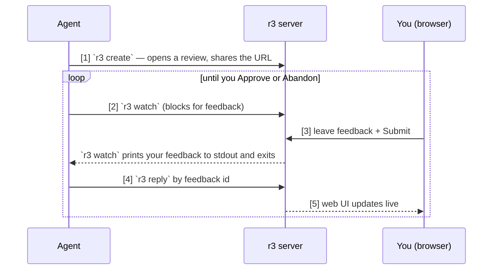

<p align="center">
  
</p>

<h1 align="center">r3: Review. Revise. Resolve.</h1>

<p align="center"><b>Chat is a terrible UI for reviewing large amounts of agent-generated code and docs.<br>r3 is where you do it instead.</b></p>

<p align="center">
  <a href="https://www.npmjs.com/package/@hyperlogue/r3"></a>
  <a href="LICENSE"></a>
  
  <a href="https://hyperlogue.github.io/r3/demo/"></a>
</p>

Imagine your agent just wrote a 2,000-word design doc and six new files. A handful of
passages need work. In a chat box you paste each one back, retype what is wrong with
it, and from then on you are the one remembering which notes got addressed and which
quietly dropped two turns ago.

r3 is a local review tool for what your coding agent writes. Your agent opens a review
of its diff or its doc, you leave notes on the exact lines, and it works through them
one at a time. This is the loop you already know from code review, running entirely on your
own machine.

- **Your note sits on the line it's about.** Select a line of code, or a sentence
  inside a rendered Markdown doc, and type. Nothing gets pasted into a chat window to
  explain which part you meant.
- **The agent is waiting to revise.** It blocks on `r3 watch` while you read. Hit
  Submit and it wakes with your notes; its replies show up in the browser without a
  refresh.
- **Every note is tracked to resolution.** Each one carries its own thread and status,
  so three rounds later you can still see which four are open.

<div align="center">
  <video src="https://github.com/user-attachments/assets/0c1aefaf-0229-49e7-a4dc-e660dc0214f6" width="760" muted controls></video>
</div>

```sh
npm install -g @hyperlogue/r3    # or: bun add -g @hyperlogue/r3 · npx @hyperlogue/r3@latest
```

Then tell your agent to put its changes up for review. If you'd rather look before
installing anything, [**▶&nbsp;try the live demo**](https://hyperlogue.github.io/r3/demo/) —
the whole UI runs in your browser.

## Workflow

r3 offers a tight, copy-paste-free review loop between you and an agent.

<p align="center">
  
  
</p>


```mermaid
sequenceDiagram
    participant A as Agent
    participant S as r3 server
    participant U as You (browser)

    A->>S: [1] `r3 create` — opens a review, shares the URL
    loop until you Approve or Abandon
        A->>S: [2] `r3 watch` (blocks for feedback)
        U->>S: [3] leave feedback + Submit
        S-->>A: `r3 watch` prints your feedback to stdout and exits
        A->>S: [4] `r3 reply` by feedback id
        S-->>U: [5] web UI updates live
    end
```

1. The agent starts a review with **`r3 create`** and shares the URL.
2. The agent runs **`r3 watch <id>`**, which registers as a live watcher and
   waits for feedback.
3. You leave feedback anchored to the exact lines it's about, then click
   **Submit**. `watch` prints your feedback to stdout that's captured by the agent.
4. The agent works each item and **replies by feedback id**
   (`r3 reply <fid> -m "what I changed"`), saying what it changed, or the
   reasoning for why it didn't.
5. Every reply lands on the web UI through live updates. The agent `watch`es again
   until you **Approve** or **Abandon** the review.

## Quick start

r3 is driven by your coding agent, so the quickest start is to point your agent at
it. Drop this into your agent's instructions file (`AGENTS.md`, `CLAUDE.md`, or
your tool's equivalent), or just try it out by pasting it into a new session:

```md
This project uses r3 for review. Run it with whichever of these you have:
`r3` (if installed), `npx @hyperlogue/r3@latest`, `bunx @hyperlogue/r3@latest`, or
`nix run github:hyperlogue/r3 --`. `r3 guide` will show how to use it.
```

Then just ask: "put your changes up for review." Your agent runs `r3 create …`,
shares the URL, and waits while you leave feedback in the browser. Nothing needs to
be installed first — the `npx`/`bunx`/`nix` forms work standalone, and whichever one
your agent uses lazily starts the web server on localhost and opens the review.

One **web server** spans all your repos on a stable port (default 8791). The first
call spawns it automatically, so there's nothing to start by hand;
`r3 start | stop | status | restart` manage it explicitly. Open
http://127.0.0.1:8791/ to see every project's reviews in one tab.

No config needed: reviews live in one global sqlite at `$XDG_STATE_HOME/r3/r3.sqlite`
keyed by a **projects registry** (so worktrees of one clone are one project and
copies stay separate), and the web server announces itself in `$XDG_RUNTIME_DIR/r3/daemon.json`
so the CLI finds it with zero config. Run the CLI from any git repo, and it tells
the web server which project/worktree the call targets.

You rarely type the commands yourself — you ask your agent, and it runs the right
`r3 create`:

```text
"Put your working changes up for review."
  → diff review of the working tree

"Open a review of the plan doc so I can comment on it."
  → files review of that file, watched live as the agent keeps editing

"Let me review the diff between main and this branch."
  → diff review of the range

"Start a review with a scratch folder and put your draft design doc there."
  → adhoc scratch review with no git source
```

## Reviews

Every review is one of two kinds:

- A **files review** is a live view of a set of files as they are right now. r3
  watches them and re-renders on every change, so it fits work in progress: a
  design doc your agent is still writing, or a few source files you want to read
  together.
- A **diff review** is a frozen record of a change: a commit, a branch range, your
  working tree, or any diff. It doesn't move once captured, and follow-up work
  lands as new rounds you can compare against.

Feedback anchors to a **quote**, not a line number: in a files review your notes
follow the code as it's edited; in a diff review the rounds are immutable, so
nothing drifts.

## How r3 compares to similar tools

| Tool                                                                                   | How r3 differs                                                                                                                                                                                    |
| -------------------------------------------------------------------------------------- | ------------------------------------------------------------------------------------------------------------------------------------------------------------------------------------------------- |
| [difit](https://github.com/yoshiko-pg/difit) / [diffx](https://github.com/wong2/diffx) | r3 makes the review loop live. The agent `watch`es, you Submit, replies land back in the UI, tracking every item to resolution. r3 also supports raw text files like design docs, not just diffs. |
| GitHub / GitLab PRs                                                                    | r3 drives the local pre-PR loop with your agent: nothing needs a remote, a push, or even a commit.                                                                                                |
| AI review bots (CodeRabbit, Copilot code review, …)                                    | In r3 _you_ review the AI's work: the agent is the author, addressing your feedback.                                                                                                              |

If you want a one-shot look at a diff with no state left behind, difit and diffx
are good enough. r3 shines when the review outgrows a single pass — feedback
spans several rounds, and each item keeps its thread and status until it's
resolved.

## Remote access

If you work on a remote dev server, r3 listens on loopback there, and you reach
its web UI from your local device through a tunnel. Set one up however you like: an SSH
forward (`ssh -L 8791:localhost:8791 devbox`), `tailscale serve`, or a Cloudflare
tunnel. **Never** bind `0.0.0.0`.

**Exposing r3 beyond loopback turns on an optional login gate.** It's pure security
hardening — **on by default whenever r3 is exposed** (a non-loopback bind, a
non-loopback `R3_PUBLIC_URL`, or a non-loopback `R3_ALLOWED_HOSTS`), and **off on a plain
`localhost:8791`** so the default setup needs
no login at all. Over an SSH forward you browse `localhost`, so nothing changes. When
it's on, create a token on the host and paste it into the browser once: the browser
posts that **login token** to the daemon to mint an HttpOnly session cookie, and from
then on holds only the cookie. (The login token is a scoped, revocable credential; the
daemon's own per-user API token — the CLI's credential — is never handed to a browser
when exposed.) Force it either way with `R3_REQUIRE_LOGIN=1|0`.

> **Behind your own reverse proxy, set `R3_REQUIRE_LOGIN=1`.** r3 decides whether
> to require a login from its own bind + advertised host — it can't see that
> through a proxy that rewrites the `Host` header to `127.0.0.1` (nginx's default
> `proxy_pass`), which reads as loopback-only and hands the browser the per-user
> token. Setting `R3_PUBLIC_URL` to the public name fixes it too; `tailscale serve`
> forwards the real host, so it's already covered.

```sh
# on the host:
r3 config set publicUrl https://myhost.tailnet.ts.net    # allows that Host + requires login
r3 restart                                                # config.json is read below env
tailscale serve --bg 8791                                 # -> https://myhost.tailnet.ts.net/
r3 auth create-token --label laptop                       # prints the token once — paste it in the browser
```

`r3 config set` **persists** these settings to `$XDG_CONFIG_HOME/r3/config.json`, so
a restart — or a daemon lazily re-spawned by any CLI call from a shell that never
exported the env vars — keeps serving remotely instead of silently dropping to
loopback-only. (`export R3_PUBLIC_URL=…` still works for a one-off run; it just
isn't remembered.) The store is a flat map — names `bind`, `port`, `publicUrl`,
`allowedHosts` (comma list), `requireLogin`: `r3 config show` dumps the JSON,
`r3 config get <name>` prints one value, `r3 config unset <name>` reverts one.

`r3 auth list-tokens` / `r3 auth revoke-token <id> | --all` manage tokens (revoking
kills its sessions immediately).

Settings: `R3_PORT` (default 8791), `R3_BIND` (default `127.0.0.1`), `R3_ALLOWED_HOSTS`
(comma-separated exact Host names, never `*`; a non-loopback name here also marks r3
exposed), `R3_PUBLIC_URL` (a non-loopback host is auto-allowed **and** marks r3
exposed, so this alone covers the common single-name `tailscale serve` case), `R3_REQUIRE_LOGIN`
(`1`/`0` to force the login requirement on or off explicitly). Each resolves
**env → `config.json` (via `r3 config set`) → default**, so env overrides the
persisted file for a single run.
