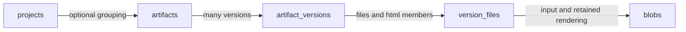
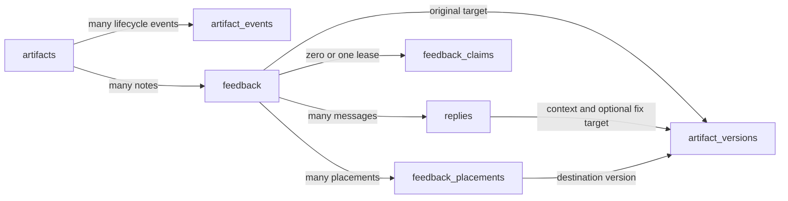
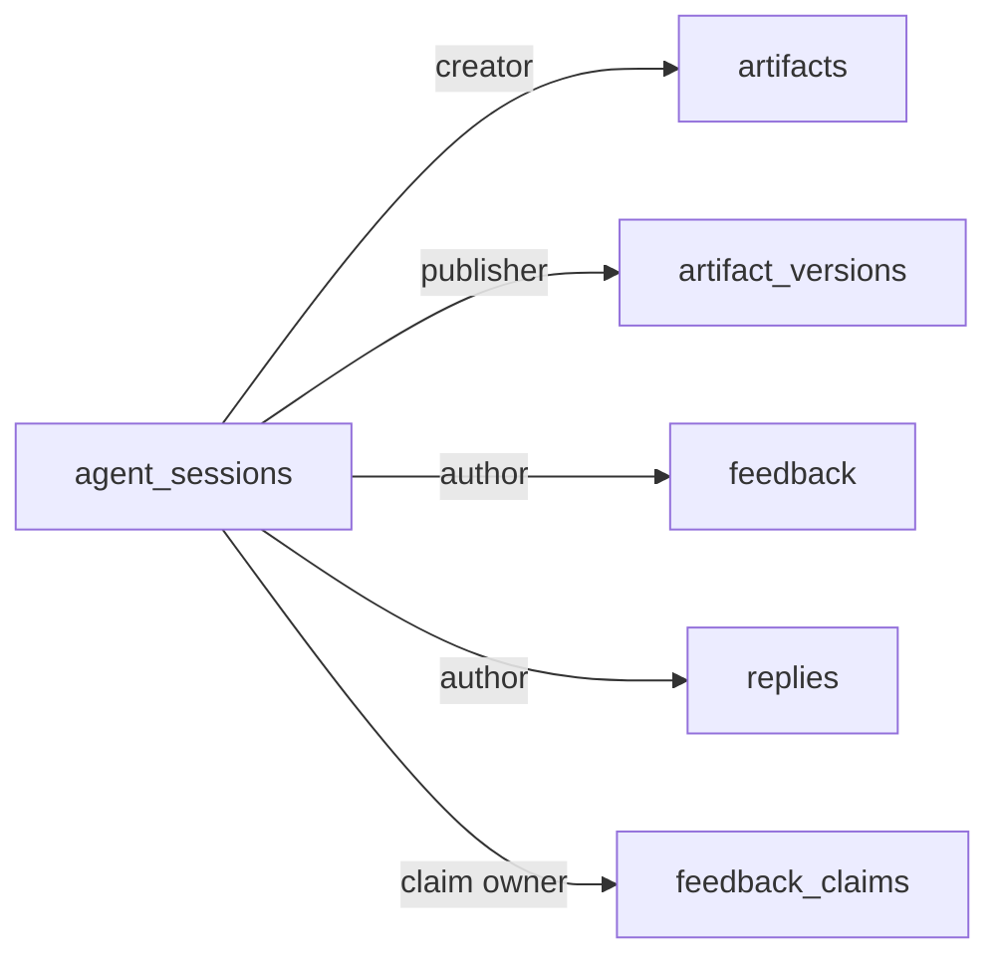

# Artifact database schema

[Executable SQLite DDL](../../server/artifact-schema.ts) · [Artifact design](design.md)

This reference explains the implemented storage constraints for one human owner
and multiple agents, including remote publishers. The linked DDL is executable;
this document records the relationships and invariants behind it. The daemon, CLI,
browser, and static demo use the same artifact protocol.

The central relationship is **Artifact → Version → Content**. Files and HTML share file storage. Diff stores its unified patch directly on the version. Feedback owns open/resolved status; Reply is a message with no status.

## Relationships







Every version reference includes artifact identity. A sequence such as 2 is meaningful only within its artifact. Composite foreign keys also prevent a reply or placement from attaching to feedback owned by another artifact.

## Tables

| Table | Key | Main columns and responsibility |
| --- | --- | --- |
| projects | id | Optional grouping: name, remote_url, created_at. The generated id is identity; a URL or local path is not |
| artifacts | id | kind, active/archived state, optional project_id, title, meta_json, next_seq, creator role/session, creation/activity/archive times, legacy_json |
| agent_sessions | id | One logical agent run: optional harness/label and created_at; attribution, not a user account or live connection |
| artifact_events | seq; unique id | Ordered archive/restore history: artifact_id, operation_key, actor/session, optional archive message, created_at |
| artifact_versions | artifact_id + seq | kind, publication_key, content_hash, label, summary, provenance_json, publisher role/session, entrypoint or patch_body, file_count, created_at, published_at |
| version_files | artifact_id + version_seq + path | media_type, original blob_hash, optional rendered_blob_hash and renderer_revision |
| blobs | hash | SHA-256 content address, byte_length, created_at. Bytes live in daemon-managed storage |
| feedback | id | Artifact ownership, author role/agent session, body, open/resolved status, immutable original target, legacy anchor evidence, delivery fields, timestamps |
| replies | id | Feedback ownership, author role/agent session, body, explicit message context, optional fix target, legacy reference evidence, delivery time. No status |
| feedback_placements | feedback_id + version_seq + document_path + representation | Additional native locator and anchored/unplaced/ambiguous match state |
| feedback_claims | feedback_id | One renewable agent_session_id-owned lease: claimed_at, renewed_at, expires_at |
| viewed_marks | artifact_id + key | Existing read-progress identity, including representation when needed |
| auth_tokens / auth_sessions | id | Existing authentication records and hashed secret values; independent of artifact content |

There is no Bundle table, withdrawal state, live worktree requirement, or separate history table for each artifact kind. The SQL repeats kind on some children so composite foreign keys and checks can enforce representation compatibility; it is not independently editable metadata.

## One version table, three content shapes

artifact_versions holds the variant payload fields directly, with a CHECK that accepts exactly one shape:

| Kind | entrypoint | patch_body | file_count | version_files |
| --- | --- | --- | --- | --- |
| files | NULL | NULL | At least one | Complete directory membership; no inferred entrypoint |
| html | index.html or index.md | NULL | At least one | Complete directory membership, including the entrypoint |
| diff | NULL | Nonempty unified patch | NULL | Forbidden |

Both directory kinds require at least one published file. Zero files would represent deleting every member, but there is no supported empty-publication workflow: publish another work product, archive it, or delete the artifact. Individual files may contain zero bytes. Creating an artifact record before its first publication does not create an empty version.

This avoids an extra join and a separate rule requiring exactly one matching subtype row. Diff remains an independent sparse patch publication; it does not acquire a synthetic file tree or depend on applying preceding versions.

An HTML entrypoint has a composite foreign key to a file in its own version. That foreign key is deferred because inserting the version and its files creates a temporary cycle. The publication transaction completes both sides before commit. Whole-artifact deletion removes both sides in one transaction. SQLite supports these deferred checks when foreign keys are enabled on the connection. [SQLite foreign keys](https://www.sqlite.org/foreignkeys.html)

For Markdown, rendered_blob_hash names the retained HTML output and renderer_revision identifies the renderer that produced it. The server prepares these before publication. Original HTML is already a rendered input; it normally needs no second stored blob. Dynamic page state and device capture remain outside the published-byte guarantee. External resource requests are blocked by the preview policy.

## Original target, message context, and placement

Feedback's original target is stored as queryable fields plus a native locator:

```text
target_kind         artifact | artifact_summary | version_summary |
                    source | rendered | diff
target_version_seq  required for version_summary/source/rendered/diff
target_path         required for source/rendered/diff
locator_json        NULL for a whole document or unquoted summary;
                    otherwise a native locator/quote object
```

Artifact-wide feedback has no path, version, or locator. `artifact_summary` is a
read-only historical target; new feedback cannot use it. Its original quote and
scope remain intact after removing the overview. Neither NULL case means latest.
Version-summary notes name their version explicitly.

Native locator examples, with artifact/version/path carried by the surrounding target:

```json
{ "start": 12, "end": 15, "quote": "selected source text" }
```

```json
{ "selector": "#revenue-chart", "quote": "Quarterly revenue", "prefix": "Results", "suffix": "Forecast" }
```

```json
{ "side": "old", "start": 12, "end": 15, "quote": "deleted source text" }
```

These illustrate source, rendered, and diff locators. The targeting module defines their validated shapes, limits, and rendered-text normalization. SQL enforces JSON-object shape and representation compatibility, while the module verifies native ranges, quotes, selectors, and document membership.

Files accepts source and rendered targets. HTML accepts rendered targets. Diff accepts diff targets with native old/new semantics. Common artifact and version-summary scopes work across all three kinds.

Replies have context_version_seq/context_representation for the message being written, independently of the optional target_kind/target_version_seq/target_path/locator_json identifying a fix. For example, a reply can discuss rendered files version 1 and point to a source fix in version 2. A NULL context means no version context was supplied; the server never silently interprets it as latest. An explicit representation requires an explicit version. Inline references use the reply's shared context; use separate replies for different message contexts. The fix target carries its own version independently.

feedback_placements records additional document placements without replacing the original target or duplicating the thread. Source and rendered placements for the same file/version can coexist. An unplaced or ambiguous result has no accepted locator. Locate can always return to the original target; a view toggle does not require cross-view matching.

## One owner, multiple agent sessions

agent_sessions identifies logical agent runs. It has no user account, permissions, notification credential, or machine-path fields. Register distinct IDs for concurrent agents and subagents; an optional harness and display label help the owner recognize them. A session row can outlive its process so attribution remains meaningful.

The references are creator_session_id on artifacts, publisher_session_id on versions, and agent_session_id on feedback, replies, claims, and lifecycle events. A human/agent role remains separate from session identity. The CLI is a transport, not a third author role. New agent writes supply an established agent session; new human writes do not. Actor roles are required in SQL. The schema requires an agent session when the role is agent and forbids an agent session when the role is human. Migration fills missing required attribution with explicit defaults before insertion; legacy gaps do not make these fields optional.

SQL verifies session existence and the role/session pairing, and prevents later edits to publication/message attribution. Claims require a session. No column assigns the entire artifact to one agent, so two agents can publish or discuss the same artifact and claim different feedback items. The server validates new-write attribution and claim ownership at the module interface.

Notification routing uses one designated listener per artifact. Assignment and fan-out are outside the current model. sent_at/status_unsent record the owner's artifact-level handoff; they do not become per-agent read receipts. If fan-out is later implemented, add explicit per-recipient delivery records rather than treating one timestamp as acknowledgement by all agents. Live connections and transport credentials remain outside SQLite.

## Archive events and optional messages

artifact_events stores archive/restore transitions and optional archive messages. It has a globally increasing seq for order, a stable external id, an artifact-scoped operation_key for retries, actor attribution, and a timestamp. The sequence keeps event order unambiguous even when timestamps are equal.

An archive message may be NULL. The server normalizes blank input to NULL; a restore event carries no archive message. Events are immutable and retained with their artifact, so Restore followed by another Archive cannot overwrite the previous message. They are separate from feedback because an archive message has no open/resolved lifecycle.

The collaboration transaction checks state, updates artifacts.state/archived_at, inserts the lifecycle event, and clears claims. Retrying the same operation returns the stored event; mismatched reuse conflicts. The current archive event is obtained from the ordered history, and live terminal notifications carry its explicit event ID. State/event consistency and notification routing are server transaction responsibilities rather than SQL triggers.

The module captures and removes the current listener registration during the ordered transition. After commit, browser/watch clients receive the lifecycle update. If an archive message exists, the captured listener receives it; otherwise no agent nudge is sent. watch terminates either way, printing the message when present. A failed nudge leaves the saved message readable and is reported; it does not enqueue work for a future listener after Restore. Notification is not exactly-once delivery, and its success does not mark unrelated feedback delivered.

## Atomic publication

published_at is the visibility and finalization marker. A version starts with it NULL inside a transaction; the server serves only rows where it is non-NULL. This is internal assembly state, not a user-facing draft version.

1. Receive and validate the complete publication. Verify original byte hashes, paths, sizes, patch syntax or directory shape, and required Markdown renderings. Atomically install immutable blobs before referencing them from committed SQL rows.
2. Begin an IMMEDIATE transaction. Look up the artifact's publication_key first: a matching retry returns the original version; reuse with different content, metadata, or publisher attribution conflicts.
3. For a new publication, check active state and compare the caller's expected sequence with the latest published sequence (zero if none). Advance next_seq and use the allocated sequence for the new row.
4. Insert the unpublished version, blob metadata, and all version_files. The file_count records the expected complete membership and must be positive for both files and html.
5. Set published_at. The finalization trigger checks active state, complete file count, and HTML entrypoint membership. Commit; only then broadcast the publication event.

The expected-sequence check and allocation occur under the same IMMEDIATE
transaction in `ArtifactStore.publish`. The equivalent SQL condition is:

```sql
UPDATE artifacts
SET next_seq = next_seq + 1
WHERE id = :artifact_id
  AND state = 'active'
  AND COALESCE((
    SELECT MAX(seq) FROM artifact_versions
    WHERE artifact_id = :artifact_id AND published_at IS NOT NULL
  ), 0) = :expected_seq
RETURNING next_seq - 1 AS allocated_seq;
```

The allocated sequence can exceed `expectedSeq + 1`: migration reserves identities
from missing historical rounds. The comparison uses visible publication history;
allocation uses the never-reused sequence counter.

A zero-row result is a conflict or an archived/missing artifact, which the server distinguishes. The expected sequence is the latest published sequence, independent of reserved migration gaps. Published versions are never hidden or individually deleted; any gaps inherited from migration stay reserved. The server must never commit an unfinished publication. A crash before commit rolls back its SQL allocation and membership; any unreferenced installed bytes are eligible for later cleanup.

`content_hash` identifies canonical content: kind and patch bytes for diff, or
kind, entrypoint, and sorted paths with original byte hashes/media types for
directories. The retry check separately compares label, summary, provenance, and
publisher role/session. Assigned sequence, server timestamps, and generated
renderings are excluded from the content hash. Rendering hashes identify those
outputs independently, so retries remain stable across renderer upgrades.

## Enforcement and retention

| Enforced by the database | Enforced by the server modules |
| --- | --- |
| Fixed artifact kind and valid kind-specific version payload | Authorization, upload limits, safe paths and symlink handling |
| Version ownership and same-artifact message references | Target path membership, native locator validation, dynamic DOM evidence |
| Complete declared file count and HTML entrypoint membership at finalization | Actual byte availability and integrity, complete rendering preparation, canonical publication digest |
| Immutable version payload, file rows, original feedback target, and reply context/fix target | Expected-sequence transaction, retry behavior, no committed assembly rows |
| No additional files after publication; no individual version/file deletion | Archive/event atomicity, optional message notification, cleanup of leases/listeners, and unconditional watch termination |
| Nondecreasing sequence counter; unique publication and lifecycle operation keys | Retry behavior, claim ownership/expiry, human-controlled status, agent reply releasing only its matching claim |
| Typed states, JSON-object shape, required target fields, agent-session foreign keys | New-write actor/session validation, sent_at/status_unsent delivery rules and activity timestamps |
| Foreign-key cascades on whole-artifact deletion | SSE after commit, byte-store garbage collection, browser isolation |

These rules belong behind the publication, content, targeting, and collaboration module interfaces. Callers do not implement the transaction choreography themselves.

Versions are append-only and remain visible until whole-artifact deletion. There is no withdrawn_at field, withdrawal command, visibility filter, or individual version deletion. SQL prevents deleting a version or its file membership while its artifact exists. Corrections are new publications.

Deleting an artifact cascades through versions, files, feedback, replies, placements, claims, lifecycle events, and read progress. Shared blobs remain until garbage collection proves they have no original or rendered references. Agent-session records can also outlive an artifact and cannot be deleted while referenced elsewhere. Deleting a project only detaches its artifacts. Archiving preserves content and feedback status; the collaboration transaction clears claims and presence without implying resolution.

All connections must enable foreign keys. STRICT tables constrain storage types, and explicit NULL checks prevent required variant fields from slipping through SQL's nullable CHECK semantics. Times are canonical UTC ISO-8601 strings supplied by the server. [SQLite STRICT tables](https://www.sqlite.org/stricttables.html), [SQLite CHECK constraints](https://www.sqlite.org/lang_createtable.html#check_constraints)

## Migration from legacy reviews

| Legacy storage | Artifact storage |
| --- | --- |
| reviews | artifacts; preserve stored identity, translate lifecycle, retain legacy source/worktree/status provenance |
| Approved/abandoned state and closure metadata | Synthetic archived event; original outcome and any closure message remain in artifact legacy provenance; no fresh notification |
| repos | Optional projects; old location/worktree metadata remains migration provenance, never a content lookup key |
| patches | diff artifact_versions with the original round sequence and stored patch_body |
| snapshots / snapshot_files | files artifact_versions / version_files / blobs for bytes that were actually retained |
| feedback.patch_seq and source anchor fields | Verified typed original target, or explicit legacy evidence when version/representation is unknown |
| replies.ref_version and pin fields | Explicit context and fix target only when the old reference is supported by surviving content |
| Known agent/session metadata | agent_sessions and required attribution references; missing values receive documented migration defaults |
| feedback_claims | Preserve evidence and clear old leases; the new protocol requires fresh claims |
| viewed_marks, auth tables | Preserve read progress and the login token/session contract |

Do not present migration-generated defaults as recovered historical facts. Required fields still receive valid values; provenance records how they were chosen. Do not fabricate missing historical source bytes, patch bodies, or verified rendered/source correspondence. legacy_json, legacy_anchor_json, and legacy_reference_json preserve unresolved historical evidence. A note whose target cannot be established can retain artifact scope plus that evidence, displayed as a historical target unavailable; it must not be presented as an originally general note. A later verified placement remains separate.

Startup migrates supported legacy stores before serving artifact requests. The
old command, route, event, and client protocols are retired; preserved review IDs
still open as artifact URLs.

Migration records incomplete publications and generated notices in provenance.
New publications use the complete-directory contract. `next_seq` starts above every
preserved or historically referenced sequence, including missing rounds. The DDL
defines the current schema; `migration.ts` owns the upgrade from old tables.

`server/migration.ts` owns the upgrade transaction. Startup supplies an exclusively
owned connection, a new backup path in a private directory, the byte store,
renderer, and optional one-time local capture adapter. It creates a consistent
0600 SQLite backup, checks for a concurrent writer, renames the legacy tables,
imports into the constrained destination, checks references and integrity, then
commits the schema marker. Failure or process interruption rolls back schema and
data together; a retry takes another backup and reuses immutable byte content.
Unknown schemas and orphaned content stop the upgrade without discarding rows.

`migration-content.ts` preserves retained file and patch identities and reserves
missing sequence ranges. `migration-conversations.ts` preserves message IDs,
delivery state, supported native targets, and uncertain historical evidence.
Obsolete work leases are retained as evidence and cleared: agents must establish
their sessions and transport registrations under the new protocol. Authentication
hash records retain the existing cookie contract. Viewed marks carry forward,
with SHA-256 keys added when retained bytes establish the old content identity.

## Required fields and migration defaults

Migration applies explicit defaults before inserting into the constrained schema.
Missing historical fields do not weaken the rules for ordinary writes. Each
fallback records its source entity, field, value, and reason.

created_by, published_by, and artifact_events.actor are NOT NULL. Agent-authored artifacts, versions, events, feedback, and replies must reference an agent session; human-authored rows must have no agent session. Ordinary write requests supply required attribution explicitly. There is no blanket SQL default that would silently convert a malformed new agent request into human authorship.

| Missing legacy information | Migration default |
| --- | --- |
| Creator/publisher role | Recover a known role/session when available; otherwise use human, the single owner's fallback attribution |
| Archive/restore actor | Use the known actor; otherwise human, matching the owner-driven lifecycle |
| Known agent role but no session | Create a deterministic imported session with label Imported agent; retain any known grouping, and do not merge unrelated unknown agents into one inferred identity |
| Required creation timestamp | Reuse an appropriate existing source timestamp; if none survives, use the migration time and record that fallback |
| File media type | Derive from retained content/path when possible; otherwise application/octet-stream |
| Old files snapshot with no recoverable member files | Materialize a MIGRATION.md notice explaining that no original files were retained; explicitly mark it as migration-generated and preserve the original empty record in provenance |
| Original target cannot be established | Use the existing artifact-level target variant, preserving the old anchor evidence; do not invent a precise verified placement |

For example, a role defaulted to human is usable by the normal model, while migration provenance records that the original role was absent. An Imported agent session is a migration-created attribution record, not proof of a recovered historical process or a live listener. A generated notice is real stored content satisfying file_count > 0, clearly identified as generated; simply setting file_count to 1 without a file would be invalid.

Store the source evidence and a defaults list identifying entity, field, chosen value, and reason in the artifact's legacy_json or the version's provenance_json. Record generated files there too. This keeps migration assumptions inspectable without sending NULL through required product fields. Missing diff bodies remain documented gaps with reserved sequences; a fake patch is not a meaningful default.

NULL remains where absence is a supported state: no project grouping, no optional archive message, no fix target, no version context for a general message, no agent session for a human, a kind-inapplicable payload column, or a publication being assembled inside its transaction. These are product or transaction semantics, not concessions to legacy data.

## Verification

[Schema tests](../../server/artifact-schema.test.ts) exercise the executable DDL.
[Publication tests](../../server/artifacts.test.ts) cover atomic visibility, retries,
concurrent publishers, retained Markdown, archive races, and whole-artifact deletion.
[Migration tests](../../server/migration.test.ts) cover preservation and recovery.
See [acceptance checks](verification.md) for browser and distribution verification.

## Retiring artifact overviews

Schema revision 2 removes `artifacts.summary`. Upgrading revision 1 first writes
an owner-only consistent backup, then retains existing text in
`legacy_json.retiredOverview` and drops the column in one transaction. Original
`artifact_summary` feedback targets stay unchanged and readable, but are rejected
for new comments. The old live-review migration retains its overview in the
original review provenance. Version summaries are unaffected.
