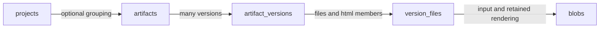
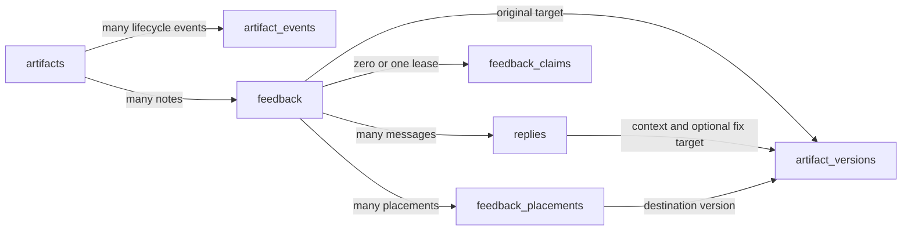
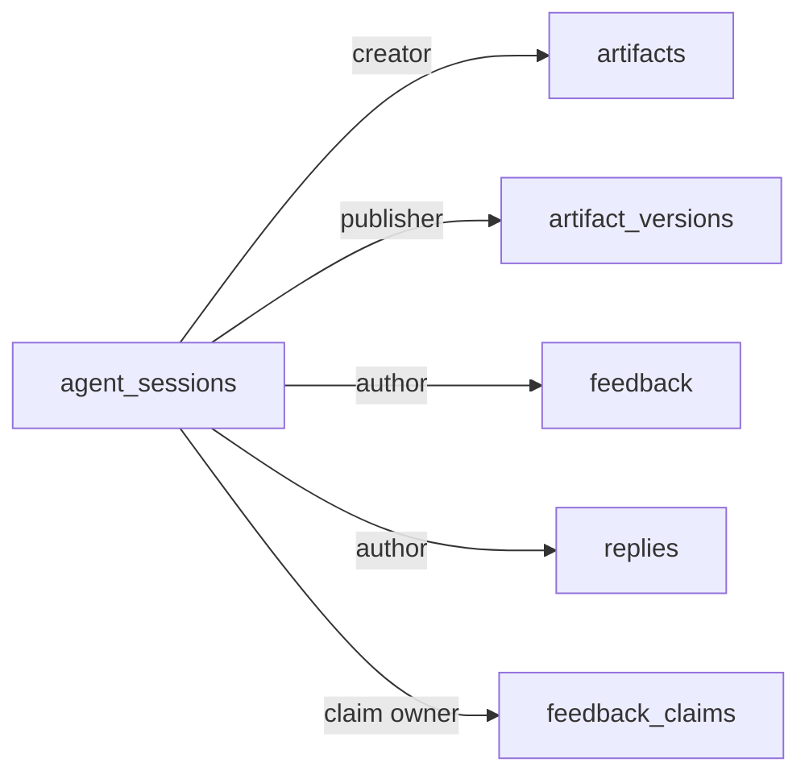

# Artifact database schema

[Executable SQLite DDL](../../server/artifact-schema.ts) · [Artifact design](design.md)

This reference explains the implemented storage constraints for one human owner
and multiple agents, including remote publishers. The linked DDL is executable;
this document records the relationships and invariants behind it. The daemon, CLI,
browser, and static demo use the same artifact protocol.

The central relationship is **Artifact → Version → Content**. Files and HTML share file storage. Diff stores its unified patch directly on the version. Feedback owns open/resolved status; Reply is a message with no status.

## Relationships


```mermaid
flowchart LR
  P[projects] -->|optional grouping| A[artifacts]
  A -->|many versions| V[artifact_versions]
  V -->|files and html members| F[version_files]
  F -->|input and retained rendering| B[blobs]
```


```mermaid
flowchart LR
  A[artifacts] -->|many lifecycle events| E[artifact_events]
  A -->|many notes| F[feedback]
  F -->|many messages| R[replies]
  F -->|zero or one lease| C[feedback_claims]
  F -->|many placements| P[feedback_placements]
  F -->|original target| V[artifact_versions]
  R -->|context and optional fix target| V
  P -->|destination version| V
```


```mermaid
flowchart LR
  S[agent_sessions] -->|creator| A[artifacts]
  S -->|publisher| V[artifact_versions]
  S -->|author| F[feedback]
  S -->|author| R[replies]
  S -->|claim owner| C[feedback_claims]
```

Every version reference includes artifact identity. A sequence such as 2 is meaningful only within its artifact. Composite foreign keys also prevent a reply or placement from attaching to feedback owned by another artifact.

## Tables

| Table | Key | Main columns and responsibility |
| --- | --- | --- |
| projects | id | Optional grouping: name, remote_url, created_at. The generated id is identity; a URL or local path is not |
| project_remotes | remote_key | Unique normalized repository identity mapped to one project; project_id is also unique and cascades on project deletion |
| artifacts | id | kind, active/archived state, optional project_id, title, meta_json, next_seq, creator role/session, creation/activity/archive times, legacy_json |
| agent_sessions | id | One logical agent run: optional harness/label and created_at; attribution, not a user account or live connection |
| artifact_events | seq; unique id | Ordered archive/restore history: artifact_id, operation_key, actor/session, optional archive message, created_at |
| artifact_versions | artifact_id + seq | kind, publication_key, content_hash, label, summary, provenance_json, publisher role/session, entrypoint or patch_body, file_count, created_at, published_at |
| version_files | artifact_id + version_seq + path | media_type, original blob_hash, optional rendered_blob_hash and renderer_revision |
| blobs | hash | SHA-256 content address, byte_length, created_at. Bytes live in daemon-managed storage |
| feedback | id | Artifact ownership, author role/agent session, body, open/resolved status, immutable original target, legacy anchor evidence, delivery fields, timestamps |
| replies | id | Feedback ownership, author role/agent session, body, explicit message context, optional fix target, legacy reference evidence, delivery time. No status |
| feedback_placements | feedback_id + version_seq + document_path + representation | Additional native locator and anchored/unplaced/ambiguous match state |
| feedback_claims | feedback_id | One renewable agent_session_id-owned lease: claimed_at, renewed_at, expires_at |
| viewed_marks | artifact_id + key | Existing read-progress identity, including representation when needed |
| auth_tokens / auth_sessions | id | Existing authentication records and hashed secret values; independent of artifact content |

Authentication retains `last_used_at` for successful logins and cookie requests.
Cookie-use writes are coalesced per token and flushed each minute and on graceful
storage close; listings include pending activity.
Inactivity expiry is calculated from the effective last-use timestamp and leaves
rows intact until storage startup removes inactive tokens and their sessions.
`revoked_at` records manual revocation. The
[security model](../../.claude/skills/security-model/SKILL.md#browser-login-and-configuration)
owns inactivity configuration and validation.

There is no Bundle table, withdrawal state, live worktree requirement, or separate history table for each artifact kind. The SQL repeats kind on some children so composite foreign keys and checks can enforce representation compatibility; it is not independently editable metadata.

## One version table, three content shapes

artifact_versions holds the variant payload fields directly, with a CHECK that accepts exactly one shape:

| Kind | entrypoint | patch_body | file_count | version_files |
| --- | --- | --- | --- | --- |
| files | NULL | NULL | At least one | Complete directory membership; no inferred entrypoint |
| html | index.html (historical versions may use index.md) | NULL | At least one | Complete directory membership, including the entrypoint |
| diff | NULL | Nonempty unified patch | NULL | Forbidden |

Both directory kinds require at least one published file. Zero files would represent deleting every member, but there is no supported empty-publication workflow: publish another work product, archive it, or delete the artifact. Individual files may contain zero bytes. Creating an artifact record before its first publication does not create an empty version.

This avoids an extra join and a separate rule requiring exactly one matching subtype row. Diff remains an independent sparse patch publication; it does not acquire a synthetic file tree or depend on applying preceding versions.

New HTML publications require `index.html`. The stored variant also accepts
historical `index.md` entrypoints so retained versions remain readable without
rewriting their content or targets.

An HTML entrypoint has a composite foreign key to a file in its own version. That foreign key is deferred because inserting the version and its files creates a temporary cycle. The publication transaction completes both sides before commit. Whole-artifact deletion removes both sides in one transaction. SQLite supports these deferred checks when foreign keys are enabled on the connection. [SQLite foreign keys](https://www.sqlite.org/foreignkeys.html)

For Markdown, rendered_blob_hash names the retained HTML output and renderer_revision identifies the renderer that produced it. The server prepares these before publication. Original HTML is already a rendered input; it normally needs no second stored blob. Dynamic page state and device capture remain outside the published-byte guarantee. Preview network guarantees depend on the selected policy: verified blocking is the default; consented compatibility has browser-dependent gaps, and HTML-only external mode permits broader requests. See the [security model](../../.claude/skills/security-model/SKILL.md#preview-host).

## Content storage accounting

Artifact JSON includes computed `storage.totalBytes` and `storage.latestVersionBytes`.
The total sums each distinct original or retained-rendering blob referenced by the
artifact's published versions once, plus the UTF-8 bytes of every published patch.
The latest-version value applies the same rule within the highest published
sequence; it is the full footprint, not the bytes added by that publication.
Both values are zero before the first publication. Unpublished rows, orphaned blobs,
and sequence reservations do not contribute. Accounting uses committed membership
and byte metadata without reading blob files or storing a separate mutable counter.

Identical bytes share one SHA-256 blob across paths, versions, and artifacts.
Changed files are stored whole; there is no file delta compression. Patches live
in their version rows and are counted separately even when identical. Database
metadata, conversations, indexes, backups, and filesystem allocation overhead are
excluded. A blob shared by two artifacts counts toward both totals, so an artifact's
reported total does not predict disk space reclaimed by its deletion.

## Original target, message context, and placement

Feedback's original target is stored as queryable fields plus a native locator:

```text
target_kind         artifact | artifact_summary | version_summary |
                    source | rendered | diff | media
target_version_seq  required for version_summary/source/rendered/diff/media
target_path         required for source/rendered/diff/media
locator_json        NULL for a whole document or unquoted summary;
                    otherwise a native locator/quote object
```

Artifact-wide feedback has no path, version, or locator. `artifact_summary` and
`version_summary` are historical targets only. Their original quotes and scopes
remain intact; version-summary evidence names its recorded version. New feedback,
reply fix targets, and placements reject both summary kinds. NULL never means latest.

Native locator examples, with artifact/version/path carried by the surrounding target:

```json
{ "start": 12, "end": 15, "quote": "selected source text" }
```

```json
{ "selector": "#revenue-chart", "quote": "Quarterly revenue", "prefix": "Results", "suffix": "Forecast" }
```

```json
{ "side": "old", "start": 12, "end": 15, "quote": "deleted source text" }
```

These illustrate source, rendered, and diff locators. The targeting module defines their validated shapes, limits, and rendered-text normalization. SQL enforces JSON-object shape and representation compatibility, while the module verifies native ranges, quotes, selectors, and document membership.

For source/diff locators, `start`/`end` identify the complete inclusive line range;
`quote` may be an exact excerpt anywhere within it. Validation requires all range
lines to exist in the explicit version/file/side, contiguous diff capture, and a
nonblank quote contained within those lines. The existing 100-line range and
16,384-character input-quote limits still apply. The browser submits at most four
lines and 2,048 UTF-16 code units, without storing display ellipses as source.
`GET /api/feedback/:id/source` returns `ArtifactSourceRange` from immutable bytes
on demand; it stores no expanded copy and changes no delivery or claim state.

A rendered locator may also carry `label`, a nonempty plain-text location name of
at most 200 characters, normalized for whitespace. HTML reply fix links show this
agent-chosen name instead of a filename. It is presentation metadata and never
participates in matching. It is retained in `locator_json`; older locators need
no migration.

Files accepts source, rendered and media targets. HTML accepts rendered targets. Diff accepts diff targets with native old/new semantics. General artifact feedback works across all three kinds. Version summaries remain immutable descriptive metadata displayed in the navigation's details popup.

Replies have context_version_seq/context_representation for the message being written, independently of the optional target_kind/target_version_seq/target_path/locator_json identifying a fix. For example, a reply can discuss rendered files version 1 and point to a source fix in version 2. A NULL context means no version context was supplied; the server never silently interprets it as latest. An explicit representation requires an explicit version. Inline references use the reply's shared context; use separate replies for different message contexts. The fix target carries its own version independently.

feedback_placements records additional document placements without replacing the original target or duplicating the thread. Source and rendered placements for the same file/version can coexist. An unplaced or ambiguous result has no accepted locator. Locate can always return to the original target; a view toggle does not require cross-view matching.

## One owner, multiple agent sessions

agent_sessions identifies logical agent runs. It has no user account, permissions, notification credential, or machine-path fields. Register distinct IDs for concurrent agents and subagents; an optional harness and display label help the owner recognize them. A session row can outlive its process so attribution remains meaningful.

The references are creator_session_id on artifacts, publisher_session_id on versions, and agent_session_id on feedback, replies, claims, and lifecycle events. A human/agent role remains separate from session identity. The CLI is a transport, not a third author role. New agent writes supply an established agent session; new human writes do not. Actor roles are required in SQL. The schema requires an agent session when the role is agent and forbids an agent session when the role is human. Migration fills missing required attribution with explicit defaults before insertion; legacy gaps do not make these fields optional.

SQL verifies session existence and the role/session pairing, and prevents later edits to publication/message attribution. Claims require a session. No column assigns the entire artifact to one agent, so two agents can publish or discuss the same artifact and claim different feedback items. The server validates new-write attribution and claim ownership at the module interface.

Notification routing uses one designated listener per artifact. Assignment and fan-out are outside the current model. sent_at/status_unsent record the owner's artifact-level handoff; they do not become per-agent read receipts. If fan-out is later implemented, add explicit per-recipient delivery records rather than treating one timestamp as acknowledgement by all agents. Live watch/remote connections remain transient. Local delivery targets and fallback/explicit registrations persist in separate private tables.

Feedback also retains an internal `ever_delivered` flag. New human notes start
false; agent notes start true. Handoff sets it true, and edits never clear it.
Editing an open human note can clear `sent_at` for the current text while retaining
the history needed to send a later resolution or reopening. A status change on a
new, never-delivered note does not create status work. Replies retain their own
delivery timestamps; they do not need this feedback-status history flag.

## Archive events and optional messages

artifact_events stores archive/restore transitions and optional archive messages. It has a globally increasing seq for order, a stable external id, an artifact-scoped operation_key for retries, actor attribution, and a timestamp. The sequence keeps event order unambiguous even when timestamps are equal.

An archive message may be NULL. The server normalizes blank input to NULL; a restore event carries no archive message. Events are immutable and retained with their artifact, so Restore followed by another Archive cannot overwrite the previous message. They are separate from feedback because an archive message has no open/resolved lifecycle.

The collaboration transaction checks state, updates artifacts.state/archived_at, inserts the lifecycle event, and clears claims. Retrying the same operation returns the stored event; mismatched reuse conflicts. The current archive event is obtained from the ordered history, and live terminal notifications carry its explicit event ID. State/event consistency and notification routing are server transaction responsibilities rather than SQL triggers.

The module captures and removes the current listener registration during the ordered transition. After commit, browser/watch clients receive the lifecycle update. If an archive message exists, the captured listener receives it; otherwise no agent nudge is sent. watch terminates either way, printing the message when present. A failed nudge leaves the saved message readable and is reported; it does not enqueue work for a future listener after Restore. Notification is not exactly-once delivery, and its success does not mark unrelated feedback delivered.

## Atomic publication

published_at is the visibility and finalization marker. A version starts with it NULL inside a transaction; the server serves only rows where it is non-NULL. This is internal assembly state, not a user-facing draft version.

1. Receive and validate the complete publication. Verify original byte hashes, paths, sizes, patch syntax or directory shape, and required Markdown renderings. Atomically install immutable blobs before referencing them from committed SQL rows.
2. Begin an IMMEDIATE transaction. Look up the artifact's publication_key first: a matching retry returns the original version; reuse with different content, metadata, or publisher attribution conflicts.
3. For a new publication, check active state and compare the caller's expected sequence with the latest published sequence (zero if none). Advance next_seq and use the allocated sequence for the new row.
4. Insert the unpublished version, blob metadata, and all version_files. The file_count records the expected complete membership and must be positive for both files and html.
5. Set published_at. The finalization trigger checks active state, complete file count, and HTML entrypoint membership. Commit; only then broadcast the publication event.

The expected-sequence check and allocation occur under the same IMMEDIATE
transaction in `ArtifactStore.publish`. The equivalent SQL condition is:

```sql
UPDATE artifacts
SET next_seq = next_seq + 1
WHERE id = :artifact_id
  AND state = 'active'
  AND COALESCE((
    SELECT MAX(seq) FROM artifact_versions
    WHERE artifact_id = :artifact_id AND published_at IS NOT NULL
  ), 0) = :expected_seq
RETURNING next_seq - 1 AS allocated_seq;
```

The allocated sequence can exceed `expectedSeq + 1`: migration reserves identities
from missing historical rounds. The comparison uses visible publication history;
allocation uses the never-reused sequence counter.

A zero-row result is a conflict or an archived/missing artifact, which the server distinguishes. The expected sequence is the latest published sequence, independent of reserved migration gaps. Published versions are never hidden or individually deleted; any gaps inherited from migration stay reserved. The server must never commit an unfinished publication. A crash before commit rolls back its SQL allocation and membership; any unreferenced installed bytes are eligible for later cleanup.

`content_hash` identifies canonical content: kind and patch bytes for diff, or
kind, entrypoint, and sorted paths with original byte hashes/media types for
directories. The retry check separately compares label, summary, provenance, and
publisher role/session. Assigned sequence, server timestamps, and generated
renderings are excluded from the content hash. Rendering hashes identify those
outputs independently, so retries remain stable across renderer upgrades.

## Enforcement and retention

| Enforced by the database | Enforced by the server modules |
| --- | --- |
| Fixed artifact kind and valid kind-specific version payload | Authorization, upload limits, safe paths and symlink handling |
| Version ownership and same-artifact message references | Target path membership, native locator validation, dynamic DOM evidence |
| Complete declared file count and HTML entrypoint membership at finalization | Actual byte availability and integrity, complete rendering preparation, canonical publication digest |
| Immutable version payload, file rows, original feedback target, and reply context/fix target | Expected-sequence transaction, retry behavior, no committed assembly rows |
| No additional files after publication; no individual version/file deletion | Archive/event atomicity, optional message notification, cleanup of leases/listeners, and unconditional watch termination |
| Nondecreasing sequence counter; unique publication and lifecycle operation keys | Retry behavior, claim ownership/expiry, human-controlled status, agent reply releasing only its matching claim |
| Typed states, JSON-object shape, required target fields, agent-session foreign keys | New-write actor/session validation, sent_at/status_unsent delivery rules and activity timestamps |
| Foreign-key cascades on whole-artifact deletion | SSE after commit, byte-store garbage collection, browser isolation |

These rules belong behind the publication, content, targeting, and collaboration module interfaces. Callers do not implement the transaction choreography themselves.

Versions are append-only and remain visible until whole-artifact deletion. There is no withdrawn_at field, withdrawal command, visibility filter, or individual version deletion. SQL prevents deleting a version or its file membership while its artifact exists. Corrections are new publications.

Deleting an artifact cascades through versions, files, feedback, replies, placements, claims, lifecycle events, and read progress. Shared blobs remain until garbage collection proves they have no original or rendered references. Agent-session records can also outlive an artifact and cannot be deleted while referenced elsewhere. Deleting a project only detaches its artifacts. Archiving preserves content and feedback status; the collaboration transaction clears claims and presence without implying resolution.

All connections must enable foreign keys. STRICT tables constrain storage types, and explicit NULL checks prevent required variant fields from slipping through SQL's nullable CHECK semantics. Times are canonical UTC ISO-8601 strings supplied by the server. [SQLite STRICT tables](https://www.sqlite.org/stricttables.html), [SQLite CHECK constraints](https://www.sqlite.org/lang_createtable.html#check_constraints)

## Artifact schema upgrades

Startup upgrades artifact schema versions 1–10 to the current schema before serving
requests. Live-review stores are rejected without changing their schema or rows;
upgrade them with r3 1.5.0 before opening them with a newer release.

`server/migration.ts` owns the upgrade transaction. Startup supplies an exclusively
owned connection and a new backup path in a private directory. It creates a
consistent 0600 SQLite backup, checks for a concurrent writer, upgrades the schema,
checks references and integrity, then commits the schema marker. Failure or process
interruption rolls back schema and data together. A retry takes another backup.
Unknown or newer schemas stop the upgrade before creating a backup.

Already-imported history remains readable. Preserved review IDs still open as
artifact URLs, and `next_seq` remains above all retained or historically referenced
sequences, including missing rounds. `legacy_json`, `legacy_anchor_json`, and
`legacy_reference_json` retain uncertain source evidence and migration defaults.
Treat generated notices, fallback attribution, and imported timestamps as recorded
migration decisions, not recovered historical facts. An unavailable original target
stays explicit; a later verified placement remains separate. The current daemon
never reads an old repository, worktree, scratch directory, or live document.

Schema version 3 adds `project_remotes` without changing project IDs, primary
remote metadata, or artifact membership. Existing primary remotes are matched
lazily using the same normalization as new requests; duplicate historical matches
require explicit selection or configuration. Backfilling missing primary remotes
uses authenticated project updates, optionally requiring `expectedRemoteUrl: null`.
The schema upgrade never inspects local Git repositories.

Schema version 4 adds `local_agent_targets` (session-to-harness delivery details) and
`artifact_listeners` (artifact, fallback/explicit mode, registration ID, session, time).
These rows belong to the local daemon; public reads expose only listener identity,
name, and mode. Publication and archive update registrations inside their existing
transactions. Explicit failure deletes by registration ID, so an older failing send
cannot remove a replacement. Fallback failures retain the saved target. SQLite and
its backups are private and now contain local harness credentials. Session labels
are mutable display names; internal IDs and authored attribution remain stable.

Schema version 5 adds `feedback.ever_delivered`. Previous schemas could erase the
only delivery timestamp during an edit, so the upgrade conservatively sets this
flag for all existing notes. It preserves existing timestamps, pending flags, and
messages. A later status change can therefore cause an extra notification for an
old never-delivered note, rather than silently losing a change to a previously
delivered note. New notes use exact delivery history.

Schema version 6 adds private `artifacts.feedback_revision`, starting at zero for
existing artifacts without changing their delivery state. Conversation mutations,
acknowledgments that deliver content, and archive/restore increment it in the same
transaction. Pending-read fingerprints bind artifact, selection, and revision, so
stale acknowledgments cannot consume later content even after edit/revert cycles
or daemon restarts. Claims do not advance it. The daemon accepts acknowledgments
only with a matching fingerprint; reading pending data never stamps delivery.

## Required fields and historical evidence

created_by, published_by, and artifact_events.actor are NOT NULL. Agent-authored artifacts, versions, events, feedback, and replies must reference an agent session; human-authored rows must have no agent session. Ordinary write requests supply required attribution explicitly. There is no blanket SQL default that would silently convert a malformed new agent request into human authorship.

NULL remains where absence is a supported state: no project grouping, no optional archive message, no fix target, no version context for a general message, no agent session for a human, a kind-inapplicable payload column, or a publication being assembled inside its transaction. These are product or transaction semantics, not concessions to legacy data.

## Verification

[Schema tests](../../server/artifact-schema.test.ts) exercise the executable DDL.
[Publication tests](../../server/artifacts.test.ts) cover atomic visibility, retries,
concurrent publishers, retained Markdown, archive races, and whole-artifact deletion.
[Migration tests](../../server/migration.test.ts) cover preservation and recovery.
See [acceptance checks](verification.md) for browser and distribution verification.

## Retiring artifact overviews

Schema revision 2 removes `artifacts.summary`. Upgrading revision 1 first writes
an owner-only consistent backup, then retains existing text in
`legacy_json.retiredOverview` and drops the column in one transaction. Original
`artifact_summary` feedback targets stay unchanged and readable, but are rejected
for new comments. Previously imported live-review overviews remain in the
original review provenance. Version summaries are unaffected.


## Conversation attachments

`message_attachments` owns an opaque image ID, artifact identity, exactly one
feedback/reply owner, ordering, content-addressed blob hash, validated raster media
type/dimensions, and optional capture-context JSON. Composite foreign keys prevent
cross-artifact ownership. Original targets and published version membership are
unaffected. Old messages have empty attachment lists; schema version 7 adds these
tables to version 6 stores under the existing backup/atomic upgrade procedure.

New bytes are validated and installed under the blob store's GC hold, then image
membership and message changes commit in one SQLite transaction. A failed mutation
can leave only unreferenced bytes, reclaimed by normal GC. GC marks attachment and
publication references together. Removing a message cascades attachment membership;
archive preserves it. `storage.attachmentBytes` counts distinct referenced image
blobs separately from `totalBytes` and `latestVersionBytes` (published content).

`message_operations` binds an optional create/reply operation key to artifact,
canonical request fingerprint, and owning message. An unchanged replay returns the
message; changed input conflicts. Editing preserves omitted attachments and replaces
an explicitly supplied ordered list. Existing IDs may be retained only on their
original message. Image changes advance the persisted conversation revision and
use the same delivery rules as text changes, including edit/revert detection.


## Derived search index

Schema version 8 adds `artifact_search_versions`, `artifact_search_documents`,
and an external-content FTS5 index with insert/update/delete triggers. The daemon
uses its injected connection as the sole writer. Upgrade creates empty derived
tables after the normal private backup; it preserves publications and conversations.

`artifact_search_versions` marks completely indexed publications and counts skipped
files. Content is read only through immutable published membership, prepared before
a short transaction, and made searchable atomically with its completion marker.
A search rechecks current published sequences after asynchronous reads. Deletion
during preparation cannot reintroduce content. Foreign-key cascades remove indexed
versions, messages, and artifacts, with matching FTS deletions.

Search reconciles current artifact metadata and message text immediately before
its synchronous result snapshot. Message edits, including edit-and-revert, never
leave stale searchable text. Conversation targets and reply context remain native
records; search adds no placement, resolution, delivery, or ownership state.
The index can be rebuilt from retained publications and current messages. Its
database space is overhead and is excluded from published-content storage totals.


## Usage history and archive cleanup

Schema revision 9 adds `artifact_activity` counters keyed by UTC instant and
metric, with no artifact/session identity, foreign key, path, title, or message
body. Insert/commit triggers count artifact creation, committed publications,
new feedback, new replies, and archive/restore events in the originating
transaction. Rollback and operation-key replay cannot add activity. Deleting
feedback or artifacts leaves counters intact. `artifact_activity_coverage`
records the upgrade instant; backfill counts surviving rows once and never
claims to reconstruct previously deleted activity. Fresh stores have complete
coverage. UTC instants are bucketed in the daemon's timezone at read time, so
calendar days and Monday-start weeks handle DST without assuming 24-hour days.

Global content bytes deduplicate original files, retained Markdown renderings,
and feedback images together across all published artifacts. Each published
patch contributes its UTF-8 length separately. Unreferenced blobs and disk
metadata, indexes, WAL files, and backups are excluded. Reclaimable content
counts only hashes whose every reference belongs to the selected expired set,
plus that set's patches; it is not a prediction of filesystem free space.

`archiveTtlDays` defaults to 30 and accepts 1..36500. Eligibility compares
`archived_at <= now - ttlDays * 24 hours`; edits, replies and reads do not extend
it. Restore clears the timestamp; another archive starts a fresh TTL. Explicit
GC deletes eligible whole artifacts and uses the existing blob collection hold.
Web confirmation carries the preview's IDs and archive timestamps: newer
eligible artifacts are not silently added, and changed timestamps are skipped.
Per-artifact failure does not prevent remaining deletions. Projects and agent
sessions survive, as does anonymous activity history. No automatic expiry job
is installed.

## Native media evidence

Schema version 10 extends files targets and message contexts with `media`.
A media locator stores `time` (one finite nonnegative video instant in seconds,
or null for a still image) and `box` (normalized x/y/width/height). Missing boxes
normalize to the full frame. Media placement inference is deferred; original and
explicit reply fix targets retain their own version, file and geometry.

`message_attachments.purpose` separates ordinary `message` attachments from the
single immutable `target` snapshot. Existing rows default to `message`. A create
or reply requires `mediaSnapshot` containing full-frame PNG/JPEG bytes for a media
target. The snapshot is validated under the GC hold and committed atomically with
the message. Ordinary attachment lists and edits exclude it. Reads expose its
metadata as `target.locator.frame`; bytes use the existing authenticated attachment
route. Four ordinary images and one target snapshot fit the 40 MiB request limit.
Message deletion cascades both kinds; archive, text edits and attachment edits
retain target evidence. Existing blob accounting and GC cover both purposes.

The upgrade backs up the database, rebuilds the constrained conversation tables
in one transaction, preserves all rows/indexes/triggers, adds the purpose column,
and checks foreign keys and integrity before enabling service.

## Schema 11: backend authorization and worker recovery

`client_authorizations` stores API-key hashes and OAuth authorization metadata,
current refresh hash, expiry, and revocation. `client_access` stores expiring access
hashes. `client_refresh_history` retains consumed refresh hashes to detect reuse.
`client_devices` holds hashed device/user codes, expiry, decision, and polling
cadence. `client_audit` records approval and connection observations with server
time and separate CLI, browser, and worker source addresses. No plaintext bearer
or device secret is stored. Browser login tables and existing sessions are preserved.

`worker_registrations` stores immutable registration ID, worker ID, artifact ID,
canonical subscription body, and `active|disconnected|retired` state. It contains
opaque listener IDs and attribution only. Startup converts active records to
disconnected; registration presence requires an authenticated live connection.
Replacement and archive retire saved identities transactionally, including offline
intent. Retired records cannot return, even when a retirement event was lost.
Artifact deletion cascades their records.

